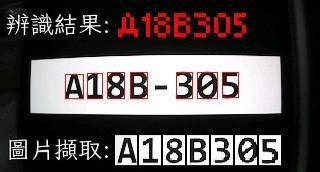

# Text Recognition Demo | 文字辨識示範專案

This repository is an **extension of the STM32F407-lvgl-fft-display-W5500-REACT-password-project**, focusing on implementing character recognition logic using OpenMV and MicroPython. The goal is to identify and display text—including Chinese labels—**within the OpenMV IDE preview window**. This sub-project includes static image resources, a demonstration video, and the main MicroPython script.

本倉庫為 **STM32F407-lvgl-fft-display-W5500-REACT-password-project 的子專案**，主要實現文字辨識功能，採用 OpenMV 與 MicroPython 技術完成。在辨識過程中，文字（包括中文標籤）會**顯示於 OpenMV IDE 的預覽視窗中**。本專案包含靜態圖像資源、實作影片與主要辨識程式碼。

---

## 📁 Project Structure | 專案結構

- `chinese/`  
  Contains Chinese text images such as `[辨識結果:]` and `[圖片截取:]`, used to label recognition output on the preview screen.

  儲存中文顯示圖像，例如 `[辨識結果:]` 與 `[圖片截取:]`，會在預覽畫面中標示辨識結果。

- `testpgm/`  
  Includes character templates in `.pgm` format (A–Z, 0–9), **pre-generated using Python** from system fonts.

  包含英數字形 `.pgm` 模板（A–Z、0–9），**提前以 Python 將系統字體轉換而得**，供辨識比對使用。

- `A18B305.mp4`  
  A recorded demonstration video showing the real-time recognition process using OpenMV.

  一段使用 OpenMV 進行即時辨識的操作影片，完整展示實際效果。

- `ncyu.py`  
  The core **MicroPython** script for OpenMV, responsible for image capture, template matching, and result overlay.

  核心 **MicroPython** 程式，於 OpenMV 上執行影像擷取、模板比對與結果疊加顯示。

- `A18B305.jpg`  
  A representative screenshot extracted from the demo video.

  自影片中擷取的靜態畫面，用以示意辨識流程。

---

## 🖼️ Demo Screenshot | 示意畫面

